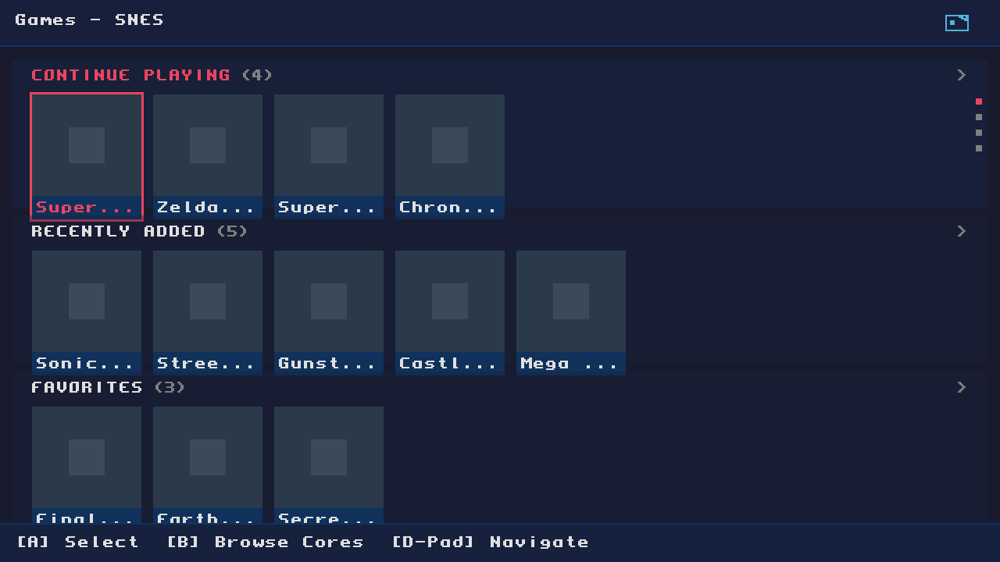
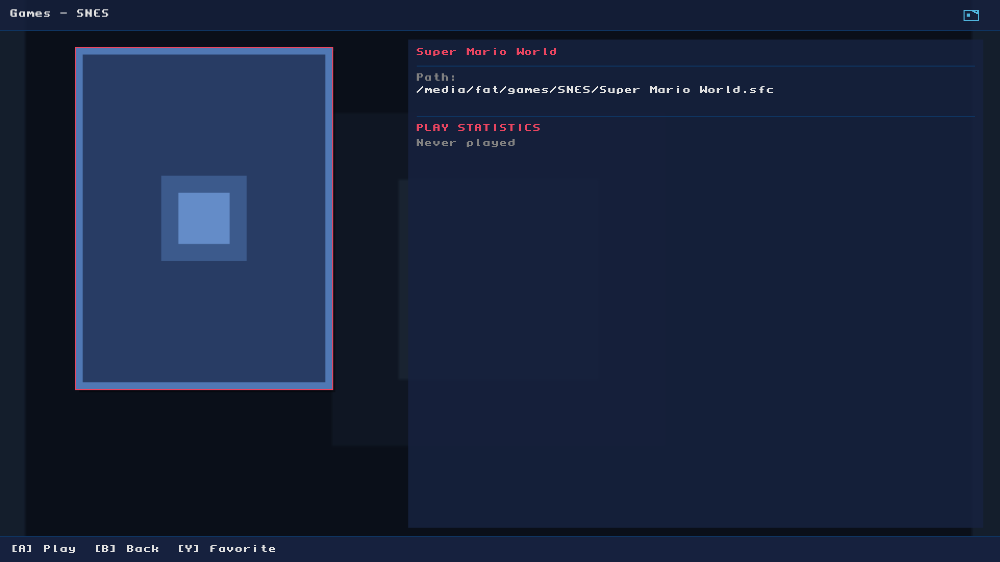
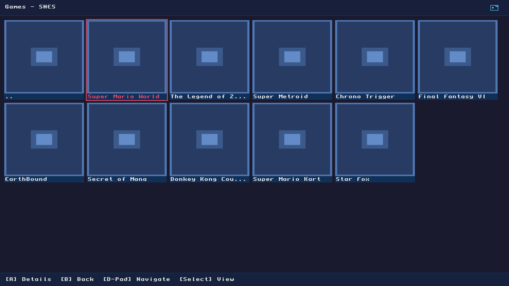
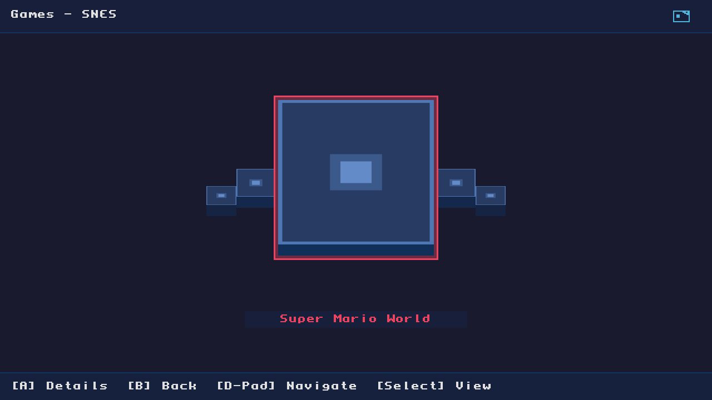

# Custom MiSTer Frontend

A custom user experience for [MiSTer FPGA](https://github.com/MiSTer-devel/Main_MiSTer), featuring a modernized interface with multiple view modes and enhanced navigation.

## Features

- **Home Screen** - Quick access to Continue Playing, Recently Added, Favorites, and Cores
- **Game Details** - Full-screen view with boxart, metadata, and play statistics
- **Multiple View Modes** - List, Grid, and Wheel views for browsing games
- **NFC/Zaparoo Support** - Integrated NFC card scanning with visual feedback
- **Theme Support** - 6 built-in themes (Dark, Light, Retro, Neon, Minimal, Analogue)
- **Modern UI** - Refreshed visual design while maintaining MiSTer compatibility

## UI Preview

### Home Screen

### Game Details

### List View

### Grid View

### Wheel View

### NFC States
| Idle | Scanning | Card Detected | Disconnected |
|------|----------|---------------|--------------|
|  |  |  |  |

### Zaparoo Overlay

## Controls

| Button | Action |
|--------|--------|
| **D-Pad** | Navigate menus |
| **A** | Select / Confirm |
| **B** | Back / Cancel |
| **Start** | Open menu |
| **Select** | Toggle view mode |
| **Menu/OSD** | System menu |

## Building

To compile this application, follow the [MiSTer cross-compiling guide](https://mister-devel.github.io/MkDocs_MiSTer/developer/mistercompile/#general-prerequisites-for-arm-cross-compiling).

## Credits

Based on the official [Main_MiSTer](https://github.com/MiSTer-devel/Main_MiSTer) project. For MiSTer documentation and wiki, see [here](https://github.com/MiSTer-devel/Wiki_MiSTer/wiki).
