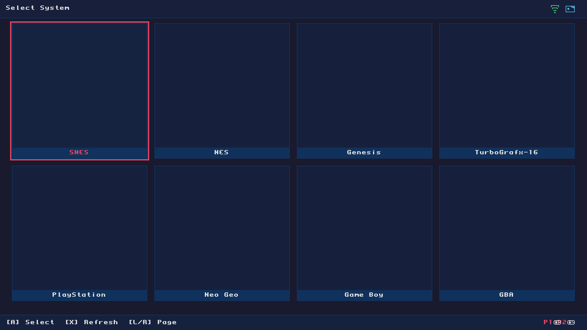
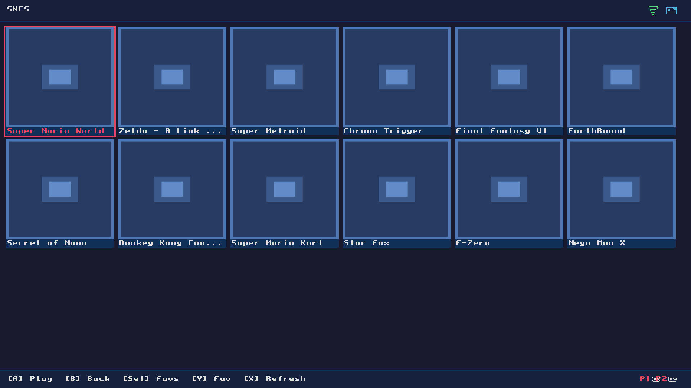
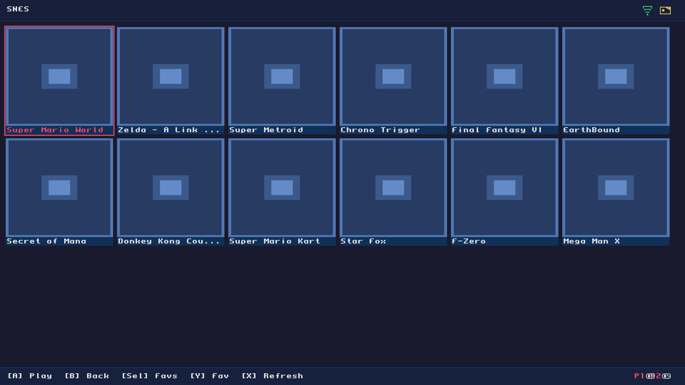
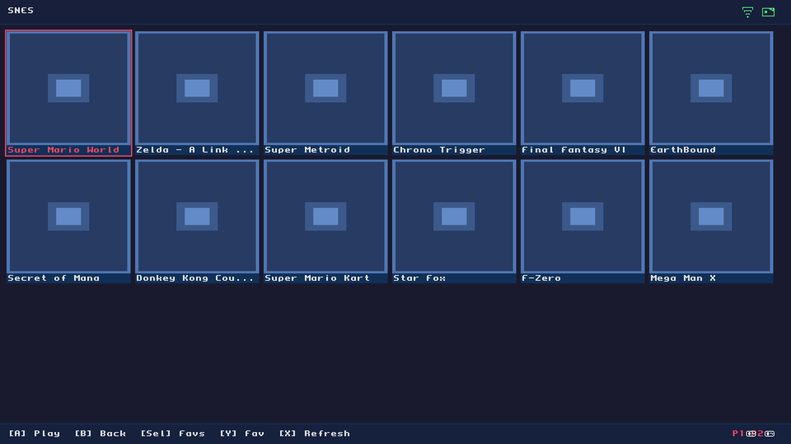
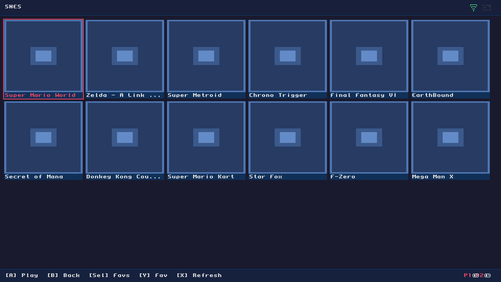
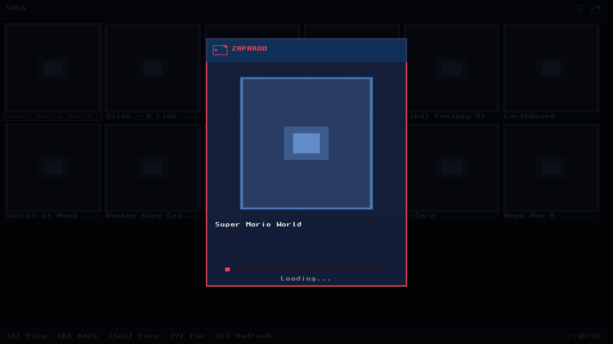

# Custom MiSTer Frontend

A simplified, grid-based user experience for [MiSTer FPGA](https://github.com/MiSTer-devel/Main_MiSTer), featuring automatic game library management and boxart downloading.

## Features

- **Grid-Based UI** - Clean, visual grid interface for browsing systems and games
- **System Selection** - Browse all your MiSTer cores in a visual grid
- **Game Browser** - View games with boxart for any system
- **Auto MGL Generation** - Automatically creates MGL launch files from your ROMs
- **Libretro Boxart** - Downloads game artwork from libretro-thumbnails (no API key needed!)
- **Background Sync** - Library syncs automatically on startup
- **NFC/Zaparoo Support** - Integrated NFC card scanning with visual feedback
- **Network Status** - WiFi/Ethernet indicator in the header
- **Controller Display** - Shows connected controllers in the footer
- **Theme Support** - Multiple built-in themes

## Supported Systems

70+ systems including:
- **Nintendo**: NES, SNES, N64, Game Boy, GBC, GBA, Virtual Boy
- **Sega**: Genesis, Mega CD, 32X, Master System, Game Gear, Saturn
- **NEC**: TurboGrafx-16, PC Engine CD, SuperGrafx
- **Sony**: PlayStation
- **SNK**: Neo Geo, Neo Geo Pocket/Color
- **Atari**: 2600, 5200, 7800, Lynx, Jaguar
- **Computers**: C64, Amiga, Atari ST, ZX Spectrum, MSX, DOS, and many more
- **Arcade**: CPS1/2/3, Neo Geo MVS, and various arcade boards

## UI Preview

### Systems Grid

### Games Grid

### NFC Status Icons
| Idle | Scanning | Card Detected | Disconnected |
|------|----------|---------------|--------------|
|  |  |  |  |

### Zaparoo Overlay

## Controls

| Button | Systems Grid | Games Grid |
|--------|--------------|------------|
| **D-Pad** | Navigate grid | Navigate grid |
| **A** | Select system | Launch game |
| **B** | - | Back to systems |
| **X** | Refresh library | Refresh library |
| **Y** | - | Toggle favorite ⭐ |
| **Select** | - | Toggle favorites filter |
| **L Shoulder** | Page up | Page up |
| **R Shoulder** | Page down | Page down |
| **Menu/OSD** | System menu | System menu |

### Favorites
- Press **Y** on any game to add/remove it from favorites
- Press **Select** to filter view to show only favorited games
- A gold star appears on favorited games in the grid

## How It Works

1. **On Startup**: The frontend scans your ROM folders (`/media/fat/games/{system}/`)
2. **MGL Generation**: Creates MGL launch files in `/media/fat/_Games/{system}/`
3. **Boxart Download**: Fetches missing artwork from libretro-thumbnails
4. **Browse & Play**: Select a system, pick a game, and play!

## Building

To compile this application, follow the [MiSTer cross-compiling guide](https://mister-devel.github.io/MkDocs_MiSTer/developer/mistercompile/#general-prerequisites-for-arm-cross-compiling).

## Credits

Based on the official [Main_MiSTer](https://github.com/MiSTer-devel/Main_MiSTer) project. For MiSTer documentation and wiki, see [here](https://github.com/MiSTer-devel/Wiki_MiSTer/wiki).
